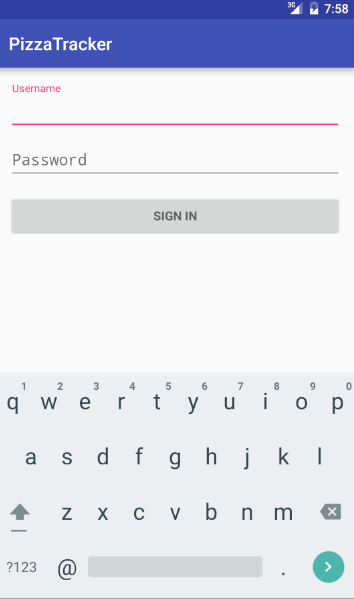
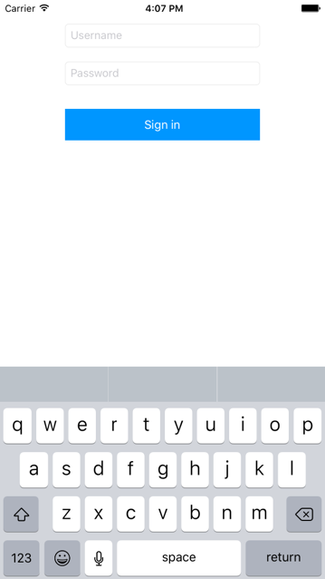
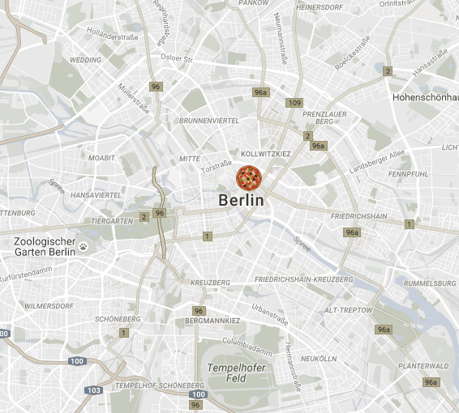

# Pizza Tracker

A very basic pizza delivery tracking application to view all pizza deliveries happen in realtime!

This can obviously do with a large amount of other features. But thats not what this demo is about.

### Android/iOS

Login to an android/iOS phone as a delivery guy with a username and password to track your position and update it live.

##### What this does
- Adds user to [list](https://deepstream.io/tutorials/core/datasync-lists/) on login
- Updates location via [record](https://deepstream.io/tutorials/core/datasync-records/) whenever changes

### Browser

##### What this does
- Gets each delivery guy from list
- Creates/Updates a google marker when moved

Awesome [Pizza Icon](https://commons.wikimedia.org/wiki/File%3APEO-pizza.svg) Attribution:
Phantom Open Emoji maintainers and contributors [CC BY 3.0 (http://creativecommons.org/licenses/by/3.0)], via Wikimedia Commons
